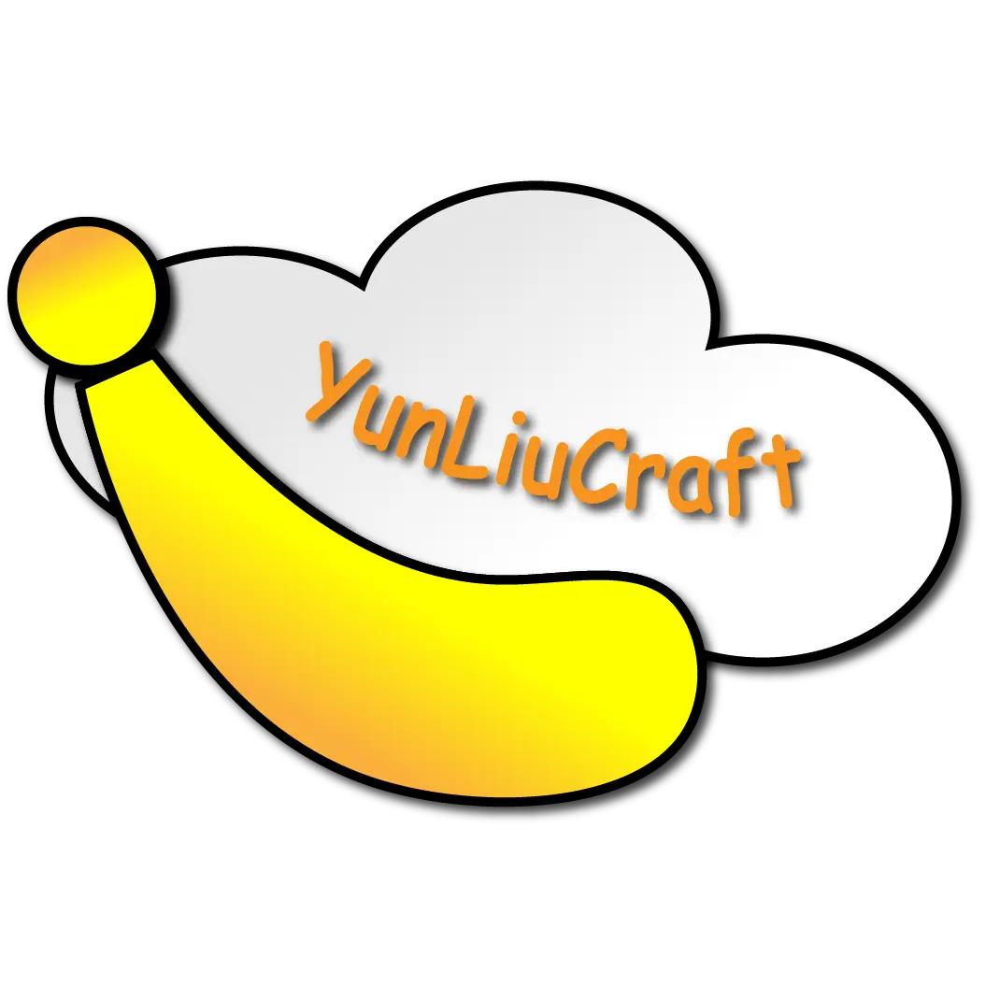

<div align='center'>

<h1>YunLiuCraft开源官网</h1>
</div>

## 注意项目目前还在开发阶段 有bug可以发起issue

## 所用到的工具&网站
> 本项目使用 [](https://cn.vuejs.org/) + [](https://lesscss.org/)
 编写  
> 使用[FontAwesome](https://www.fontawesome.com)作为网页图标(部分)  
> 使用[markdown-it](https://github.com/markdown-it/markdown-it)作为Rule页面的Markdown渲染器  
> 使用[VueToastNotification](https://github.com/ankurk91/vue-toast-notification)作为Toast(消息提醒)插件  
> 使用[minotar.net](https://minotar.net/)获取封禁列表玩家面部图片  
> 使用[NProgress](https://ricostacruz.com/nprogress/)作为加载进度条

ps:点击图片或者超链接即可进入对应网站

## 功能
- [x] 主页介绍
- [x] 规则/协议页面 Markdown文件渲染
- [x] 封禁页面(目前仅支持上传banned-players.json解析)
- [x] 404页面
- [ ] 反馈页面(正在加紧制作中)

## 部署
* **安装** [node.js](https://nodejs.org/zh-cn/) **环境**

  > node > 16.16.0  
  > npm > 8.15.0
  
* 然后以 **管理员权限** 运行 `cmd` 终端，并 `cd` 到 项目根目录
* 在 `终端` 中输入：

```bash
# 安装依赖(也可使用yarn)
npm install

# 预览(yarn dev)
npm dev

# 构建(yarn build)
npm build
```
> 构建完成后，静态资源会在 **`dist` 目录** 中生成，可将 **`dist` 文件夹下的文件**上传至服务器，也可使用 `Vercel` 等托管平台一键导入并自动部署

## 声明

**本仓库中的代码注释较少 如有难以理解的语句可以发起issues**  
**一切开发旨在学习，请勿用于非法用途**
> 本项目遵循Apache License 2.0开源协议  
> **网站是部署在vercel上的所以里面的一些关于vercel的东西可以不管:-)**  